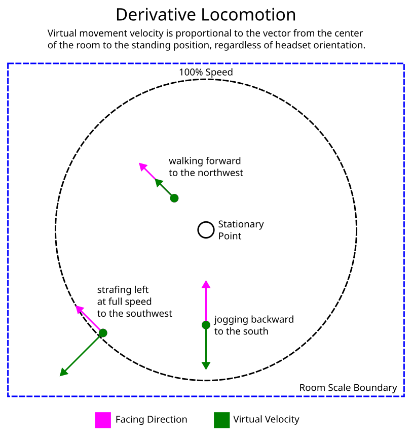

# Derivative Locomotion
Experimental position-based, hands-free VR locomotion system using a virtual controller driver for OpenVR

Since it only requires positioning data from the headset, this could be especially useful for hand-tracking applications.
The diagram below shows three examples of the resulting virtual movement when the user is standing still at those points in the room.

# Setup
The driver settings need to be adjusted to the play area dimensions, and the controller bindings need to be modified to enable it for each game in which it will be used.

## Calibration
1. Copy the **derivativeloco** folder from the drivers folder to the SteamVR drivers folder: **C:\Program Files (x86)\Steam\steamapps\common\SteamVR\drivers**
2. Launch SteamVR. There should now be a new controller device shaped like a hexagon.
3. Go to the center of the play area with the headset on and switch to the desktop view. In the SteamVR window, open the settings menu and go to Developer→Web Console. This will show the offset of the center of the room. There should be messages like this, updating once per second:

**Tue Jul 25 2023 20:43:42.936 - derivativeloco: HMD: x=1.224542, z=-1.545881, a=-0.112393   JOY: x=-1.000000, y=1.000000**

5. Open the driver’s settings file in a text editor (**C:\Program Files (x86)\Steam\steamapps\common\SteamVR\drivers\derivativeloco\resources\settings\default.vrsettings**) and set the values for **mycontroller_offset_x** and **mycontroller_offset_z** with the values from the developer console for HMD x and z.
6. Set **mycontroller_radius** to a distance in meters up to half the width of the play area. Smaller values mean it will take fewer steps to get to full speed. A value of about 0.2 could be used for standing or seated mode, where the user can lean in any direction to control the virtual movement.
7. Restart SteamVR for the new settings to take effect.

## Controller Bindings
The driver uses the **TrackedControllerRole_Treadmill** role so that it can work alongside the existing thumbstick input. It has no controller bindings by default, so it needs to be configured for each game.

1. Launch a VR game and open the controller bindings UI.
2. Switch to the controller called **Derivative Locomotion Virtual Controller**.
3. Bind the joystick input to the locomotion axes for that particular game. If unsure, check the existing binding for the left joystick on the regular controller and bind the virtual controller to the same thing.
4. Go to the **Extra Settings** tab and check the box for **Return bindings with left hand**. I’m not sure why this is necessary, but I couldn’t get it to work at all without that setting.

## In-Game Settings
Make sure the locomotion settings for the game are set to smooth locomotion. Some games have an option to make the joystick movement relative to either the headset or one of the controllers. It must be set relative to the headset since the driver compensates for headset rotation to set the virtual joystick position.
